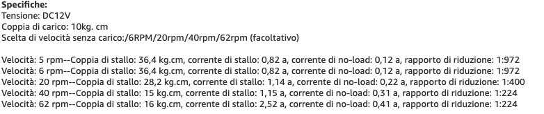

#Spesa Arduino
##Novità 
Bisogna comprare una bussola e un modulo bluetooth, forse display.
###Modulo bluetooth
Il modulo bluetooth potrebbere essere un HC-05.
[Questo venditore costa poco ed è su ebay.](https://www.ebay.it/itm/HC-05-Bluetooth-Transceiver-Host-Wireless-Modulo-Module-Master-Slave-Arduino-AVR/113192434375?hash=item1a5acb7ac7:g:2okAAOSwN91bbHFt)
Questo modulo bluetooth può essere utilizzato per programmare da remoto l'Arduino, non sono sicuro se ho abbastanza pin.

Ci sono degli esempi, alcuni richiedono un condensatore da 0.1 uF.
[Questo tipo fa cose interessanti.](https://www.mischianti.org/it/2019/01/31/arduino-programmazione-remota-wireless/)

Per prendere condensatori ce ne sono su ebay. [Condensatore ceramico da 0.1 uF.](https://www.ebay.it/itm/Condensatori-di-dischi-ceramici-Stabili-100-pz-borsa-50V-100nF-0-1uF-104pKTP/254422260326?_trkparms=aid%3D1110006%26algo%3DHOMESPLICE.SIM%26ao%3D1%26asc%3D20131003132420%26meid%3D636b5c4fe5bb4b85bd55c638566f3ef4%26pid%3D100005%26rk%3D2%26rkt%3D12%26mehot%3Dco%26sd%3D333597984476%26itm%3D254422260326%26pmt%3D1%26noa%3D0%26pg%3D2047675%26algv%3DSimplAMLv5PairwiseWebWithBBEV1Filter%26brand%3D-+Senza+marca%2FGenerico+-&_trksid=p2047675.c100005.m1851) Questo ha la spedizione gratuita.

###Bussola
Dallo stesso venditore del modulo bluetooth, ho trovato un sensore magneticoa tre assi.
[Il modello è il GY-271.](https://www.ebay.it/itm/Sensore-Magnetico-3-Assi-GY-271-QMC5883-chip-Bussola-Digitale-compatib-HMC5883L/113235178219?hash=item1a5d57b2eb:g:dQYAAOSwZTBbkOX7)
Qui viene data la libraria per usare come bussola: [eccotelo.](https://github.com/keepworking/Mecha_QMC5883L)

###Display 
Il problema del display è che occupa molti pin, quindi bisogna trovarne uno i2C, i touch screen sono molto costosi e non sono sicuro di come funzionino. La seconda possibilità sarebbe quella di usare una keypad, ma necessita un pin analogico, che forse riesco a recuperare.
La soluzione migliore, forse, è [questa] (https://www.ebay.it/itm/LCD-KEYPAD-SHIELD-16X2-BLU-6-PULSANTI-x-ARDUINO-HD44780-1602-BUTTONS/113180873379?hash=item1a5a1b12a3:g:JGMAAOSwyD9bYyEC). Però credo che con un potenziometro ed un bottone io posso fare meglio, perché questo è uno shield e non funziona con i2c, quindi la cosa diventa difficile. 

Si potrebbe utilizzare un [encoder I2C](https://www.ebay.it/itm/I2C-rotary-encoder-with-EC11-20mm-and-connectors/174226536837?hash=item2890b5f985:g:DWoAAOSw8PNedeM~), che però costa un po' di più. Però non sono sicuro se sia conveniente.

###Cose per produrre ruote

[mozzi da 4mm (robostore)](https://www.robotstore.it/Mozzo-con-asse-4mm-fori-M3-coppia)

[mozzi da 4 mm (amazon)](https://www.amazon.it/accoppiamento-connettore-accoppiatore-accessori-raccordi/dp/B0833P9RZ1/ref=sr_1_8?__mk_it_IT=%C3%85M%C3%85%C5%BD%C3%95%C3%91&dchild=1&keywords=accoppiatore%2B4mm&qid=1624287713&sr=8-8&th=1)

###Motoriduttori

Quelli da 1 Nm non bastano, le alternative:

* [motoriduttore a turbina](https://www.amazon.it/Motoriduttore-Akozon-Riduttore-Elettrico-Reversibile/dp/B07FTH12Y7/ref=pd_sbs_1/258-1080875-1393204?pd_rd_w=44rDi&pf_rd_p=ec7f37a1-a896-4722-a127-5b6242854299&pf_rd_r=XFJD6SGXEFAT0TQVNMRF&pd_rd_r=c1b856b9-df99-4678-b996-c8bf74151a5e&pd_rd_wg=s1uLd&pd_rd_i=B07FTDV1RK&th=1) con consegna gratuita e "veloce su amazon"

* [motoriduttore] (https://www.amazon.it/Motoriduttore-Akozon-Riduttore-Elettrico-Reversibile/dp/B07FTH12Y7/ref=pd_sbs_1/258-1080875-1393204?pd_rd_w=44rDi&pf_rd_p=ec7f37a1-a896-4722-a127-5b6242854299&pf_rd_r=XFJD6SGXEFAT0TQVNMRF&pd_rd_r=c1b856b9-df99-4678-b996-c8bf74151a5e&pd_rd_wg=s1uLd&pd_rd_i=B07FTDV1RK&th=1) che va solo a 5 rpm, ma scontato

[Qui](https://www.solo1.eu/motoriduttore/) c'è una spiegazione.